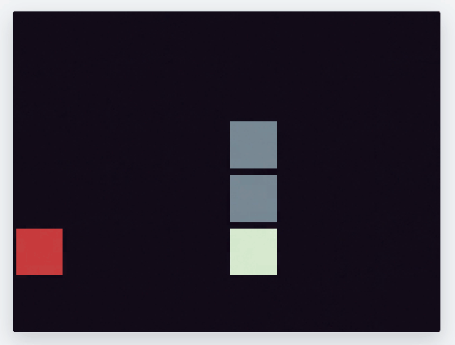
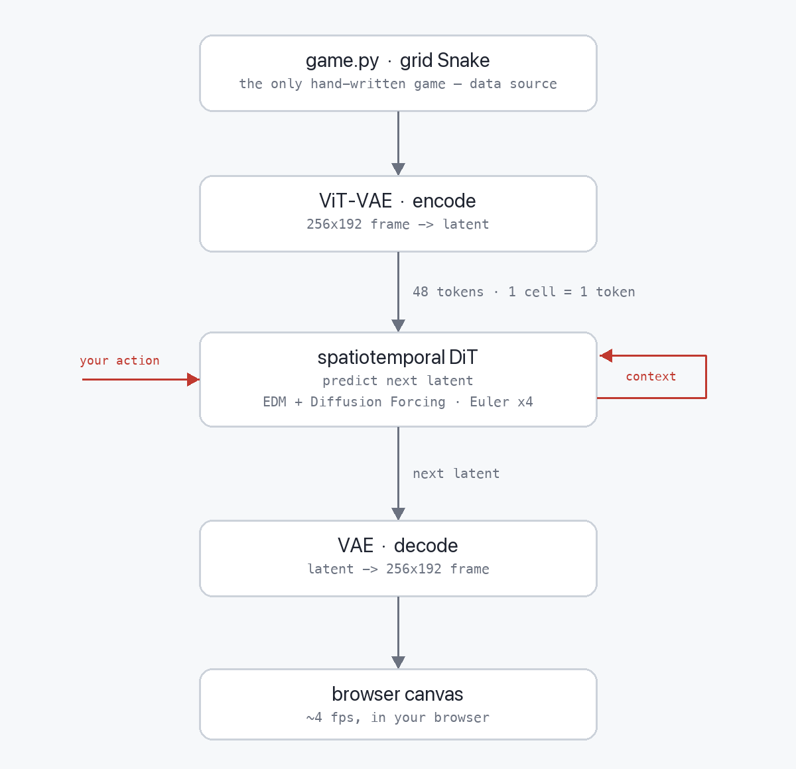

# nanoOasis

**A from-scratch reference implementation of a diffusion world model — the "nanoGPT" of the Oasis /
GameNGen / DIAMOND paradigm.** The whole pipeline in ~2,400 lines of readable Python, trainable end-to-end
for **under $50**, and playable in your browser.

<br/>

<p align="center">
  
</p>

<!-- Higher-quality hero option: drag assets/demo.mp4 into a github.com README edit (or any issue/PR comment),
     copy the user-attachments URL GitHub generates, and replace the  above with:
     <video src="THAT_URL" autoplay loop muted playsinline width="560"></video> -->

<br/>


The demo is **Snake — but there is no game engine.** Every frame is generated, one at a time, by a
13.5M-parameter diffusion model reacting to your arrow keys. The physics, the apple, the growing body —
none of it is coded. A neural net learned the whole game from pixels and now *is* the game.

**nanoOasis is the framework; Snake is just the instantiation that proves it works.** The game is one small
file that exists only to generate training data — swap it for your own and the same VAE → DiT → browser
pipeline learns to dream that one instead.

> ▶ **[Play the live demo](https://nano-oasis.vercel.app/)** · **[Code](https://github.com/MaruthiV/nanoOasis)** · blog *(coming soon)*

---

## How it works

A diffusion **world model** predicts the next frame of a game given the recent frames and your action. Roll
that forward and you can *play* a game that has no engine behind it — the model improvises each frame.

<p align="center">
  
</p>

*`game.py` only feeds training; at play time the model is the only thing generating frames.*

1. **`game.py`** is a real grid Snake. It only exists to generate training data — random + apple-seeking
   bots play millions of frames.
2. A small **ViT-VAE** compresses each 256×192 frame to a 16×24×32 latent. The grid is designed so **one
   game cell maps to exactly one DiT token** (an 8×6 board → 48 tokens) — nothing the model has to render is
   ever smaller than a token.
3. A **13.5M-parameter spatiotemporal DiT** predicts the next latent from the past 8 latents + your action,
   trained with **EDM preconditioning + Diffusion Forcing**. Four Euler sampling steps is fast enough to be
   real-time, so there's no distillation step.
4. The VAE decoder + DiT are exported to **ONNX** and run in the browser via **ONNX Runtime Web + WebGPU**.
   A **WebSocket server** (`server/ws.py`, on Modal) is the fallback for browsers without WebGPU.

A diffusion model is a great *renderer* but unreliable at discrete, rare events (like dying). So death is
handled by a tiny deterministic **referee**: the model dreams every pixel, and ~30 lines of rules adjudicate
wall/self collisions. The model dreams the world; the referee calls the game.

## Why Snake?

This started as Breakout and failed — a small, fast, *continuous* ball is exactly the regime that fights a
latent diffusion model, and the one loss knob that kept the ball alive also stopped the bricks from breaking.
The fix wasn't a better loss; it was a **better-posed game**. Snake is grid-native: discrete one-cell motion,
no sub-token objects, clean eat/grow events. The whole recipe transferred unchanged. Full write-up in the blog.

## Quickstart

```bash
pip install -e .

# play the trained model locally (pygame window, arrow keys)
python infer.py --ckpt checkpoints/dit_small_gate2_run4_155k.pt --vae checkpoints/vae_small.pt --config small

# or play it in the browser (the real demo: WebGPU in-browser inference)
python export.py                       # DiT + VAE decoder -> demo/assets/*.onnx (FP16)
cd demo && python -m http.server 8080  # open http://localhost:8080 in Chrome
```

Train it yourself end-to-end (on [Modal](https://modal.com)):

```bash
modal run modal_data_gen.py --tier baseline               # generate 500k Snake frames
modal run modal_train.py --stage vae --config small       # train the ViT-VAE (~$9)
# then pre-encode frames → latents and train the DiT on them (exact flags in docs/TASKS.md)
modal run modal_train.py --stage dit --config small       # train the 13.5M DiT (~$33)
```

## Architecture notes

Choices that matter, with the reasoning in `docs/` (decision records) and the papers cited inline in the code:

- **EDM preconditioning** (Karras 2022), not DDPM — cleaner SNR coverage, deterministic few-step sampling.
- **Diffusion Forcing** (Chen 2024) — independent per-frame noise + a causal temporal mask, for stable
  autoregressive rollout.
- **Context-noise augmentation** (GameNGen) — train on *corrupted* history so the model corrects its own
  drift at inference. This is the single fix that made long rollouts hold together.
- **Factorized spatial + temporal attention**, **AdaLN-Zero**, a **shared AdaLN MLP** (PixArt-Σ), and **2D
  axial + 1D RoPE** — a clean, small DiT.
- **Dual-path action conditioning** (token + AdaLN) with 10% dropout, freeing classifier-free guidance.
- **Euler, 4 steps** — DIAMOND's regime; real-time everywhere, so no LCM distillation.

## Repo layout

| file | what it does |
| --- | --- |
| `game.py` | grid Snake — the data source and the behavior the model imitates |
| `data_gen.py` · `data.py` | parallel bot rollouts → shards; windowed loader with event-oversampling |
| `vae.py` | ViT-VAE (256×192 frame ↔ latent) |
| `model.py` | spatiotemporal DiT |
| `diffusion.py` | EDM preconditioning + Diffusion Forcing + context-noise |
| `train_vae.py` · `train.py` | VAE and DiT training loops |
| `infer.py` | local pygame inference + the eval harness |
| `export.py` | ONNX export (DiT + VAE decoder) + seed contexts |
| `demo/` | in-browser WebGPU demo — sampler + referee + canvas UI |
| `server/ws.py` | WebSocket fallback for non-WebGPU browsers |
| `modal_*.py` · `configs/` | Modal cloud entrypoints; tiny / small / launch configs |

## Limitations

It's a 13.5M-parameter model trained for ~$50, and it plays like one. Expect crisp Snake for the first
several apples, then the long-body coherence frays — diffusion models fumble long thin structures, and error
accumulates over a rollout. The retry-on-death re-seed keeps every life starting from a clean context. This
is a *reference implementation*, not a product; it's meant to be read and forked.

## Acknowledgements

Built in the lineage of [**DIAMOND**](https://arxiv.org/abs/2405.12399) (Alonso et al.),
[**GameNGen**](https://arxiv.org/abs/2408.14837) (Valevski et al.), and [**Oasis**](https://github.com/etched-ai/open-oasis)
(Decart / Etched), and written in the spirit of [**nanoGPT**](https://github.com/karpathy/nanoGPT) — small enough to
read in an evening. nanoOasis differs in being a full **latent** stack (ViT-VAE + spatiotemporal DiT + Diffusion
Forcing), real-time few-step play, in-browser WebGPU, and the 1-cell-1-token game design.

## License

MIT.
